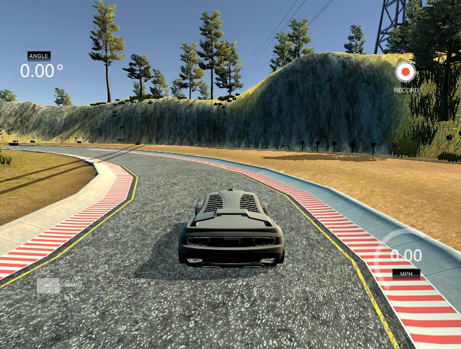

# Behaviorial Cloning Project

        

Overview

---
This repository contains files for the Behavioral Cloning Project.

In this project, deep neural networks and convolutional neural networks will be used to clone driving behavior. A model will be trained, validated and tested using Keras. The model will output a steering angle to an autonomous vehicle.

Udacity provided a simulator where user can steer a car around a track for data collection. I'll use collected image data and steering angles to train a neural network and then use this model to drive the car autonomously around the track.

The Project

---
The goals / steps of this project are the following:
* Use the simulator to collect data of good driving behavior
* Design, train and validate a model that predicts a steering angle from image data
* Use the model to drive the vehicle autonomously around the first track in the simulator. The vehicle should remain on the road for an entire loop around the track.
* Summary with the results
---

### Pipeline

---
* Using the simulator provided by Udacity, I generated data to train a model. The simulator has 2 tracks. I drove both tracks 1 lap in both directions trying to stay in the middle of the road, because with better training data the model should generalize the data better.

* Simulator generates data in the following way: there is 3 cameras mounted on the car model in the simulator (left,middle and right cameras). When user actively drives the car, images from all 3 cameras are saved in the selected by user folder.
Additionally the simulator saves log file with pathes to images and the appropriate steering angle at the moment when image was taken. The images look like this:

        
        
        

* To create augmentation data, all images from all 3 cameras were flipped and rotated. Numerous simulation were done. It seams that left and right camera have to have offset +-0.2 degree. When the model will be trained, the augmentation data will help to avoid overfitting and  imporve generalization of new samples. The image modifications are done in python module prepare_files.py. There is an image from the central camera, that was flipped and rotated:

        
        
        

* Visual information above the horizon is not relevant for training, so we crop it using keras during the model training (original images size 160px x 320px x 3channels):
        row_low = 25
        row_high = 70
        model = Sequential()
        model.add(Cropping2D(cropping=((row_high,row_low), (0,0)), input_shape=(160,320,3)))
* Neural networks work better with normalized data, so let's normalize the data:
        model.add(Lambda(lambda x: (x / 255) - 0.5))↲
* Unfortunately I didn't see significant improvement in the model performance, when the rotation of the images was done. Therefore the data augmentation was created only with flipping original images without any rotations.
* I tried several models for predicting steering angle from images (i.e. LeNet), but the best results showed the CNN, proposed by Nvidia Team. It has 5 convolutional layers and 4 fully connected layers (model.py):
      model = Sequential()
      model.add(Cropping2D(cropping=((row_high,row_low), (0,0)),  input_shape=(160,320,3)))    
      #Preprocess incoming data, centered around zero with small standard deviation•↲
      model.add(Lambda(lambda x: (x / 255) - 0.5))

      model.add(Convolution2D(24,5,5,subsample=(2,2),activation="relu"))
      model.add(Convolution2D(36,5,5,subsample=(2,2),activation="relu"))
      model.add(Convolution2D(48,5,5,subsample=(2,2),activation="relu"))
      model.add(Convolution2D(64,3,3,activation="relu"))
      model.add(Convolution2D(64,3,3,activation="relu"))

      model.add(Flatten())
      model.add(Dense(100))
      model.add(Dense(50))
      model.add(Dense(10))
      model.add(Dense(1))

      model.compile(loss='mse', optimizer='adam')

* After 3 epochs, 32 batches the loss on training and validation loss were (visualize_loss.py):

        

It seems that difference between 2 losses is huge; in reality both losses are so small and scale is too big, there 2 losses are actually very small.
* Saved keras  model was used with drive.py and video.py scripts to see the car's behavior in autonomous mode. The car managed to finish first track. On the second track it got stuck only at the end; it can be fixed by getting more data on that particular part of the road and retraining the model.

## Possible improvements

---
Trained deep neural network predicted steering angles quite good. The first track was finished completely without "accidents". On the second track the car got stuck almost at the end of the track. To improve model's performance the following can be done:

* train the model on other tracks and under other light/weather conditions, it can help model to better generalize data and avoid overfitting;

* try different deep network architectures.
